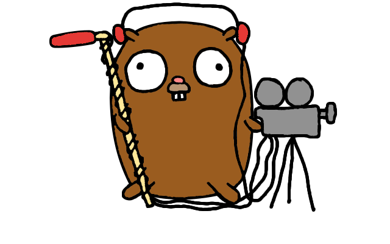

<h1 align="center">
  
   
  Pion WebRTC
   
</h1>
<h4 align="center">A pure Go implementation of the WebRTC API</h4>

  
  
  
  
   
  
  
  
  
  
  

 

See [DESIGN.md](DESIGN.md) for an overview of features and future goals.

### Breaking Changes

Pion WebRTC v2.0.0 is coming soon! HEAD will be unstable for the next few weeks as we prepare for the new release. See the [release notes](https://github.com/pions/webrtc/wiki/v2.0.0-Release-Notes) to learn about the new features breaking changes.

Have any questions? Join [the Slack channel](https://pion.ly/slack) to follow development and speak with the maintainers.

Use the tag [v1.2.0](https://github.com/pions/webrtc/tree/v1.2.0) if you'd like to continue using the v1.0 API in the meantime. After v2.0 is released v1.0 will be deprecated and unmaintained.

### Usage
Check out the **[example applications](examples/README.md)** to help you along your Pion WebRTC journey.

The Pion WebRTC API closely matches the JavaScript **[WebRTC API](https://w3c.github.io/webrtc-pc/)**. Most existing documentation is therefore also usefull when working with Pion. Furthermore, our **[GoDoc](https://godoc.org/github.com/pions/webrtc)** is actively maintained.

Now go forth and build some awesome apps! Here are some **ideas** to get your creative juices flowing:
* Send a video file to multiple browser in real time for perfectly synchronized movie watching.
* Send a webcam on an embedded device to your browser with no additional server required!
* Securely send data between two servers, without using pub/sub.
* Record your webcam and do special effects server side.
* Build a conferencing application that processes audio/video and make decisions off of it.

### WebAssembly
Pion WebRTC can be used when compiled to WebAssembly, also known as Wasm. In
this case the library will act as a wrapper around the JavaScript WebRTC API.
This allows you to use WebRTC from Go in both server and browser side code with
little to no changes. Check out the
**[example applications](examples/README.md#webassembly)** for instructions on
how to compile and run the WebAssembly examples. You can also visit the
[Wiki page on WebAssembly Development](https://github.com/pions/webrtc/wiki/WebAssembly-Development-and-Testing)
for more information.

### Roadmap
The library is in active development, please refer to the [roadmap](https://github.com/pions/webrtc/issues/9) to track our major milestones.

### Community
Pion has an active community on the [Golang Slack](https://invite.slack.golangbridge.org/). Sign up and join the **#pion** channel for discussions and support. You can also use [Pion mailing list](https://groups.google.com/forum/#!forum/pion).

We are always looking to support **your projects**. Please reach out if you have something to build!

If you need commercial support or don't want to use public methods you can contact us at [team@pion.ly](mailto:team@pion.ly)

### Related projects
* [pions/turn](https://github.com/pions/turn): A simple extendable Golang TURN server
* [WIP] [pions/media-server](https://github.com/pions/media-server): A Pion WebRTC powered media server, providing the building blocks for anything RTC.

### Contributing
Check out the **[contributing wiki](https://github.com/pions/webrtc/wiki/Contributing)** to join the group of amazing people making this project possible:

* [John Bradley](https://github.com/kc5nra) - *Original Author*
* [Michael Melvin Santry](https://github.com/santrym) - *Mascot*
* [Raphael Randschau](https://github.com/nicolai86) - *STUN*
* [Sean DuBois](https://github.com/Sean-Der) - *Original Author*
* [Michiel De Backker](https://github.com/backkem) - *SDP, Public API, Project Management*
* [Brendan Rius](https://github.com/brendanrius) - *Cleanup*
* [Konstantin Itskov](https://github.com/trivigy) - *SDP Parsing*
* [chenkaiC4](https://github.com/chenkaiC4) - *Fix GolangCI Linter*
* [Ronan J](https://github.com/ronanj) - *Fix STCP PPID*
* [wattanakorn495](https://github.com/wattanakorn495)
* [Max Hawkins](https://github.com/maxhawkins) - *RTCP*
* [Justin Okamoto](https://github.com/justinokamoto) - *Fix Docs*
* [leeoxiang](https://github.com/notedit) - *Implement Janus examples*
* [Denis](https://github.com/Hixon10) - *Adding docker-compose to pion-to-pion example*
* [earle](https://github.com/aguilEA) - *Generate DTLS fingerprint in Go*
* [Jake B](https://github.com/silbinarywolf) - *Fix Windows installation instructions*
* [Michael MacDonald](https://github.com/mjmac)
* [Oleg Kovalov](https://github.com/cristaloleg) *Use wildcards instead of hardcoding travis-ci config*
* [Woodrow Douglass](https://github.com/wdouglass) *RTCP, RTP improvements, G.722 support, Bugfixes*
* [Tobias Fridén](https://github.com/tobiasfriden) *SRTP authentication verification*
* [Yutaka Takeda](https://github.com/enobufs) *Fix ICE connection timeout*
* [Hugo Arregui](https://github.com/hugoArregui) *Fix connection timeout*
* [Rob Deutsch](https://github.com/rob-deutsch) *RTPReceiver graceful shutdown*
* [Jin Lei](https://github.com/jinleileiking) - *SFU example use http*
* [Will Watson](https://github.com/wwatson) - *Enable gocritic*
* [Luke Curley](https://github.com/kixelated)
* [Antoine Baché](https://github.com/Antonito) - *OGG Opus export*
* [frank](https://github.com/feixiao) - *Building examples on OSX*
* [mxmCherry](https://github.com/mxmCherry)
* [Alex Browne](https://github.com/albrow) - *JavaScript/Wasm bindings*
* [adwpc](https://github.com/adwpc) - *SFU example with websocket*
* [imalic3](https://github.com/imalic3) - *SFU websocket example with datachannel broadcast*
* [Žiga Željko](https://github.com/zigazeljko)
* [Simonacca Fotokite](https://github.com/simonacca-fotokite)

### License
MIT License - see [LICENSE](LICENSE) for full text
