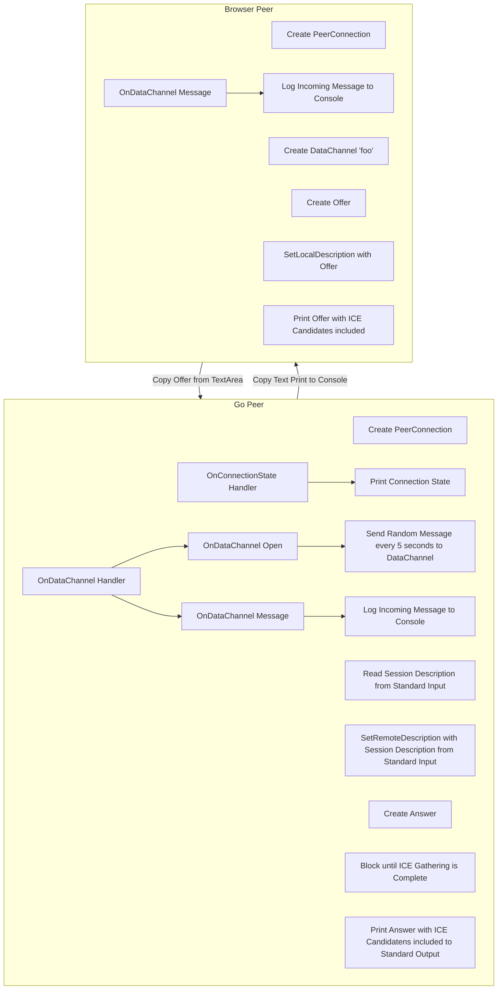

# data-channels
data-channels is a Pion WebRTC application that shows how you can send/recv DataChannel messages from a web browser

## Instructions
### Download data-channels
```
export GO111MODULE=on
go get github.com/pion/webrtc/v3/examples/data-channels
```

### Open data-channels example page
[jsfiddle.net](https://jsfiddle.net/e41tgovp/)

### Run data-channels, with your browsers SessionDescription as stdin
In the jsfiddle the top textarea is your browser's session description, press `Copy browser SDP to clipboard` or copy the base64 string manually and:
#### Linux/macOS
Run `echo $BROWSER_SDP | data-channels`
#### Windows
1. Paste the SessionDescription into a file.
1. Run `data-channels < my_file`

### Input data-channels's SessionDescription into your browser
Copy the text that `data-channels` just emitted and copy into second text area

### Hit 'Start Session' in jsfiddle
Under Start Session you should see 'Checking' as it starts connecting. If everything worked you should see `New DataChannel foo 1`

Now you can put whatever you want in the `Message` textarea, and when you hit `Send Message` it should appear in your terminal!

Pion WebRTC will send random messages every 5 seconds that will appear in your browser.

Congrats, you have used Pion WebRTC! Now start building something cool

## Architecture


