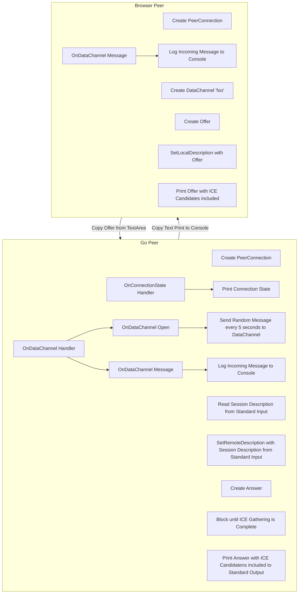

# data-channels
data-channels is Pion's sample WebRTC app that lets you send and receive DataChannel messages from a web browser.

## Brief Overview
This example will result in messages being sent between a browser and a self-hosted data-channels server. The connection is made by grabbing the browser's generated session description, or SDP, and passing it into the server. The server uses the browser's SDP to then return a new SDP from the server based on the browser's SDP. The server's SDP then gets passed back into the browser which confirms the handshake and forms a connection!

Once the connection is established, messages will automatically be sent from the data-channels server to the browser every 5 seconds. The browser has a button that lets you send a message back to the server when you click on it.

## Instructions
### 1. Download the data-channels server
```
go install github.com/pion/webrtc/v4/examples/data-channels@latest
```

### 2. Open JSFiddle
[Open this JSFiddle example page.](https://jsfiddle.net/e41tgovp/)
The top of the JSFiddle example page contains a text box containing your browser's session description (SDP).
Press `Copy browser SDP to clipboard` or copy the base64 string manually.

### 3. Send the browser's SDP to the server
Depending on your OS:

#### Linux/macOS (including WSL)
In the following command, replace `$BROWSER_SDP` with the copied string.
Run `echo $BROWSER_SDP | data-channels`.

#### Windows
1. Paste the copied string into a file.
2. Run `data-channels < my_file`.

### 4. Send the server's SDP back to the browser
The server will automatically print out a base64 string. Copy it and paste it into the second textbox in the JSFiddle page.

### 5. Start the session!
Under Start Session you should see 'Checking' as it starts connecting. If everything worked you should see `New DataChannel foo 1`.

Pion WebRTC will send random messages every 5 seconds that will appear in your browser.

### 6. Send a message from the browser to the server!
You can put whatever you want in the `Message` text area, and when you hit `Send Message` it should appear in your terminal!

## Example finished!
Congrats, you have used Pion WebRTC! Now start building something cool :)

## Architecture Overview


